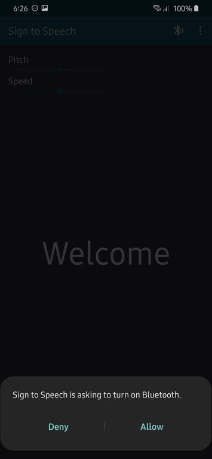
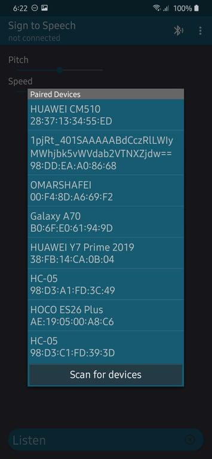
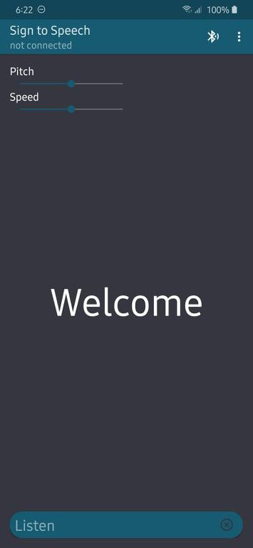
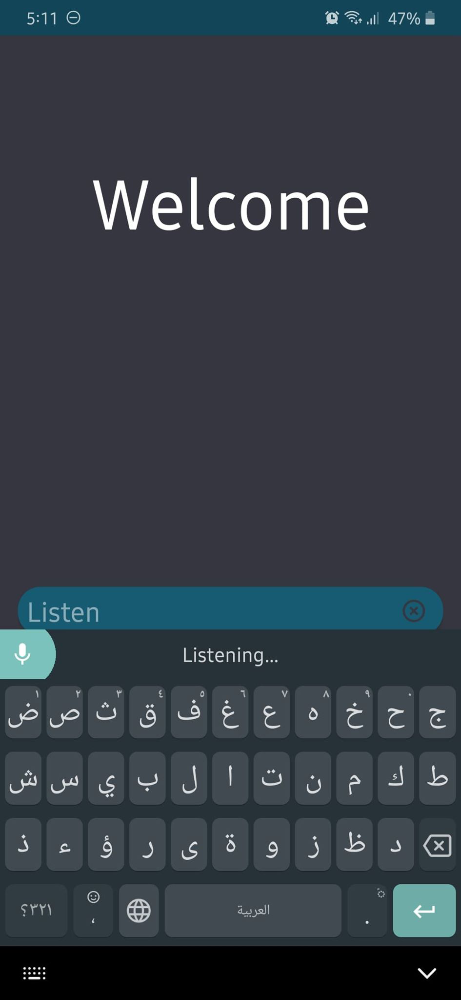

Sign To Speech
===================================

This sample shows how to implement two-way text chat over Bluetooth between two Android devices, using
all the fundamental Bluetooth API capabilities.

Introduction
------------

The sample demonstrates the following, using the [Bluetooth API][1]:

1. [Setting up][2] Bluetooth
2. [Scanning][3] for other Bluetooth devices
3. [Querying][4] the local Bluetooth adapter for paired Bluetooth devices
4. [Establishing RFCOMM][5] channels/sockets
5. [Connecting][6] to a remote device
6. [Transfering][7] data over Bluetooth

Screenshots
------------

   

   
